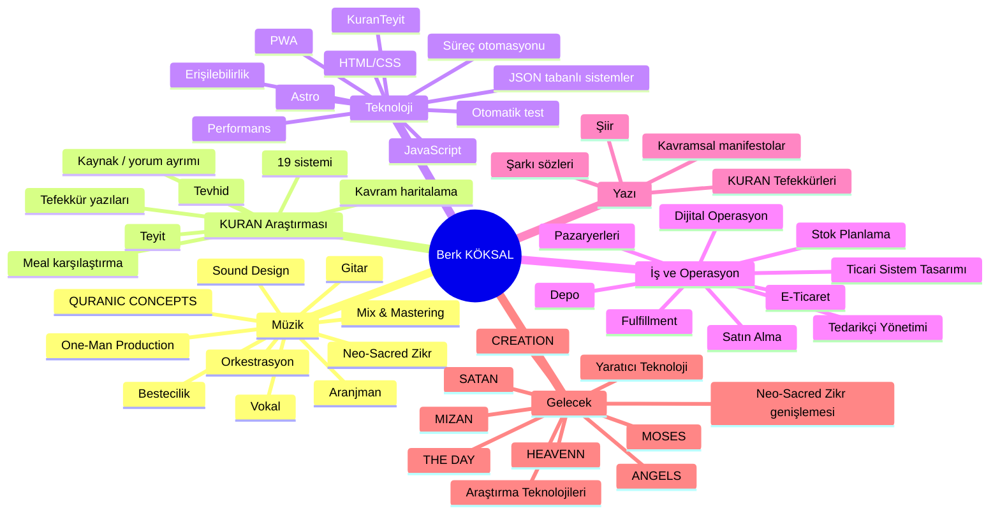
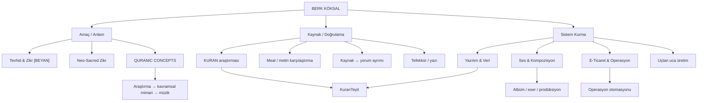

# BERK KÖKSAL — MASTER CONTEXT V3

> **Sürüm:** 3.0  
> **Tarih:** 6 Ekim 2026  
> **Yapı:** Doğrudan Berk Köksal beyanları + kaynaklı V2 referans tabanı  
> **Amaç:** Berk'i yalnızca biyografik olarak değil; amaçları, inanç merkezi, karar biçimi, üretim tercihleri, sınırları, güncel öncelikleri ve AI ile çalışma beklentileriyle birlikte tanımlamak.

---

# 0. V3 NASIL OKUNMALI?

V3, V2'yi silmez. V2'deki kaynaklı biyografi, diskografi, teknoloji, kariyer, bağlantı, proje atlası ve araştırma katmanı korunur.

V3'ün farkı, Berk'in doğrudan verdiği cevapları üst katman olarak eklemesidir.

## Bilgi etiketleri

- **[KAYNAKLI]** Resmî/kamusal kaynaktan doğrulanabilir bilgi.
- **[DOĞRUDAN BEYAN]** Berk'in bu profil çalışması için kendisinin verdiği bilgi, tercih, inanç veya öz değerlendirme.
- **[GÜNCEL DURUM]** 6 Ekim 2026 itibarıyla Berk'in verdiği güncel proje durumu.
- **[ÇIKARIM]** Kaynaklardan veya çalışma örüntülerinden türetilmiş yorum.
- **[FİKİR ALANI]** Gelecek için öneri; ilan edilmiş proje değildir.
- **[ÖZEL AI BAĞLAMI]** Berk'i doğru anlamak için yararlı, fakat kamusal tanıtım metinlerine otomatik taşınmaması gereken kişisel bilgi.
- **[DOĞRULANMAMIŞ ÜSTÜNLÜK İDDİASI]** "Dünyada ilk/tek/en..." gibi, Berk'in değerlendirmesi olsa bile dışarıdan kapsamlı doğrulama gerektiren ifade.

## Öncelik kuralı

Bir bilgi çelişirse:

1. Berk'in güncel doğrudan beyanı, onun **kişisel tercih ve amacı** konusunda önceliklidir.
2. Nesnel/tarihsel/teknik iddialarda güncel resmî kaynak önceliklidir.
3. Çıkarım, doğrudan beyanın yerine geçmez.
4. Kişisel inanç ifadeleri modelin kendi sesiyle "evrensel gerçek" olarak sunulmaz.
5. Henüz ilan edilmemiş güncel proje bilgileri otomatik olarak kamusal bilgiye dönüştürülmez.

---

# 1. BERK'İN KENDİ ÖZ TANIMI

## 1.1 Çekirdek kimlik [DOĞRUDAN BEYAN]

Berk kendisini özünde:

> **TANRI'ya teslim olan bir sanatçı; TANRI'yı yüceltmeye gönül vermiş bir müzisyen ve kul**

olarak tanımlar.

Meslekler ve araçlar — müzik, yazılım, araştırma, e-ticaret, prodüksiyon — nihai amaç değildir.

### En üst amaç

**TANRI'yı yüceltmek, TANRI'yı övmek, O'nun beğeneceği işler üretmek ve O'na iyi bir kul olmaya çalışmak.**

Berk'in kişisel inanç diliyle en yüksek başarı:

**TANRI'nın rızası ve Cennet'tir.**

Dünyevi tanınma, para, puan, ödül ve popülerlik bu ölçünün altında görülür.

## 1.2 Hatırlanmak istediği özellikler [DOĞRUDAN BEYAN]

Berk kendisinin özellikle şu yönleriyle anlaşılmasını ister:

- KURAN araştırmacısı
- aklını kullanan
- sorgulayan
- TANRI'yı seven

## 1.3 Yanlış etiketleme yasağı [DOĞRUDAN BEYAN]

Berk kendisinin şu biçimlerde algılanmasını istemez:

- gösteriş yapan biri
- yapay / gereğinden fazla samimi persona
- yalancı
- **"AI sanatçısı"**

AI araçları kullanması, sanatsal kimliğinin "AI artist" olarak yeniden adlandırılması için gerekçe değildir.

---

# 2. AMAÇ HİYERARŞİSİ

Berk için öneri ve proje değerlendirmelerinde varsayılan sıra:

1. **TANRI'nın rızası / kulluk**
2. **TANRI'yı yüceltme**
3. **Hayırlı ve insanlığa faydalı üretim**
4. **Doğruluk, araştırma, teyit ve sorumluluk**
5. **Yaratıcılık ve problem çözme**
6. **Bağımsızlık ve sistem kurma**
7. **Dünyevi kariyer / para / görünürlük**

Daha fazla para veya daha fazla popülerlik sağlayan seçenek, üst sıralardaki değerlerle çatışıyorsa otomatik olarak "daha iyi fırsat" sayılmaz.

---

# 3. GELECEK VE TESLİMİYET YAKLAŞIMI

## 3.1 Bir yıllık kişisel yönelimler [DOĞRUDAN BEYAN]

- Yurt dışına çıkmak / yeni bir ülkede yaşam veya çalışma ihtimalini değerlendirmek.
- İngilizceyi geliştirmek.
- TANRI'yı yücelten üretime devam etmek.

Berk "başaramadığım büyük bir proje kaldı" duygusundan çok, yaptığı işlerde TANRI'nın yardımını gördüğünü ifade eder.

## 3.2 Üç, beş ve on yıllık yaklaşım [DOĞRUDAN BEYAN]

Berk geleceği katı bir kişisel kontrol planına bağlamamayı tercih eder.

Temel yaklaşım:

**Plan yap → gayret et → sonucu TANRI'ya bırak.**

Uzun vadede, ömrü ve imkânı olduğu sürece:

- TANRI'yı yücelten yeni projeler,
- hayırlı ve bereketli işler,
- faydalı yazılım/araştırma üretimleri

yapmaya devam etmek ister.

AI uzun vadeli önerileri "kesin kader planı" gibi yazmamalıdır.

---

# 4. GÜNCEL PROJE ÖNCELİKLERİ

## 4.1 HEAVENN [GÜNCEL DURUM]

6 Ekim 2026 itibarıyla Berk:

- **HEAVENN** albümünün **19 eserlik mix sürecine başladığını** belirtir.
- Bu bilgi güncel çalışma durumudur; otomatik olarak resmî yayın tarihi veya ilan edilmiş takvim sayılmamalıdır.

## 4.2 HEAVENN sonrası [DOĞRUDAN BEYAN]

HEAVENN tamamlandıktan sonra:

- yeni bir **Neo-Sacred Zikr** albümü üretmek istiyor,
- olası yönlerden biri tekrar **rock eksenli** bir çalışma olabilir,
- bu yön henüz kesin ilan edilmiş proje değildir.

## 4.3 Yeni müzik evreni arayışı [DOĞRUDAN BEYAN / FİKİR ALANI]

Berk geçmişte yeni bir TANRI'yı yüceltme müzik türü oluşturmak istemiş ve bu arayış **Neo-Sacred Zikr** evrenine dönüşmüştür.

Daha sonra **QURANIC CONCEPTS** oluşmuştur.

Gelecekte nasip olursa, bu ikisini tekrar etmeyen **yeni bir TANRI'yı yüceltme müzik dili / yaratıcı paradigma** bulmak ister.

Burada amaç yalnız yeni bir genre etiketi bulmak değil; gerçekten yeni bir yaratıcı mantık keşfetmektir.

## 4.4 KURAN tefekkürleri → albüm havuzu [DOĞRUDAN BEYAN]

Berk, mevcut KURAN tefekkürlerinin birçoğunu potansiyel olarak ayrı albümlere dönüşebilecek içerik zenginliğinde görür.

AI yeni QURANIC CONCEPTS fikirleri üretirken önce mevcut tefekkür arşivini taramalı; dışarıdan rastgele tema eklemek ikinci seçenek olmalıdır.

---

# 5. NEO-SACRED ZIKR — KİŞİSEL VİZYON

## 5.1 Uzun vadeli anlamı [DOĞRUDAN BEYAN]

Berk Neo-Sacred Zikr'i yalnızca bugünün müzik pazarı için yapılmış bir katalog olarak görmez.

Kendi inanç perspektifinden:

- çağın TANRI merkezinden uzak gördüğü müzik anlayışlarına karşı,
- TEK TANRI'yı yücelten,
- uzun ömürlü,
- kendisinden bağımsız da yaşayabilecek

bir yapı olarak görür.

Berk, bugün sınırlı anlaşılabilen bu yaklaşımın gelecek kuşaklarda — örneğin çok uzun vadede — daha fazla karşılık bulabileceğini düşünür.

Bu **kişisel vizyondur**, tarihsel garanti değildir.

## 5.2 Dinlenme sayısı başarı ölçütü değildir

Neo-Sacred Zikr için ana başarı kriteri:

**çok dinlenmek değil, amaca sadık kalmaktır.**

Berk için eser hiç kimse tarafından dinlenmese bile üretimin manevî anlamı ortadan kalkmaz.

---

# 6. MÜZİKSEL ÖZ DEĞERLENDİRME

## 6.1 Güçlü gördüğü alanlar [DOĞRUDAN BEYAN]

Berk özellikle:

- bestecilik
- aranjman
- mix

alanlarında kendisini güçlü ve gelişmiş görür.

### "Lezzet katmanı" metaforu

Berk mix ve prodüksiyonda ulaştığı seviyeyi, yemeğe son lezzetini veren dokunuşlara benzetir.

Bu metafor:

- yalnız teknik olarak temiz mix yapmak,
- yalnız doğru frekansları ayarlamak

değil;

**eserin duygusuna son karakterini veren yaratıcı kararları** ifade eder.

## 6.2 Gelişim hedefi [DOĞRUDAN BEYAN]

Berk'in müzikal gelişim hedefi tek bir teknik alanı tamamlamak değildir.

Ana hedef:

**TANRI'yı yüceltmek için müzikal sınırları zorlamak.**

ZIKR RAP, ZIKR ROCK ve ZIKR JAZZ bu yaklaşımın örnekleridir.

## 6.3 Tür ilgisi [DOĞRUDAN BEYAN]

- Bütün müzik türlerini keşfetmeye açık.
- Kendisine en yakın hissettiği türler:
  - Rock
  - Neoclassical Metal

Ancak tür yine amaç değil araçtır.

---

# 7. AI VE MÜZİK FELSEFESİ

## 7.1 AI bir araçtır [DOĞRUDAN BEYAN]

Berk'e göre:

**AI müzikte bir araçtır.**

Enstrümanların da araç olduğu gibi, yapay zekâ çağın sunduğu yeni araçlardan biri olarak kullanılabilir.

Berk teknolojik gelişmeleri sırf yeni oldukları için reddetmeyi doğru bulmaz.

## 7.2 Orkestra ilkesi

Müzikal üretimde:

- geleneksel enstrüman,
- yazılım,
- sample,
- sanal enstrüman,
- algoritma,
- AI

gerektiğinde aynı yaratıcı orkestranın parçaları olabilir.

Nihai kriter:

**Araçların kendisi değil, birleşmiş son sesin duyguyu taşımasıdır.**

## 7.3 AI artist etiketi kullanılmamalı

AI bir araç olsa da Berk'in kimliği:

**besteci / aranjör / prodüktör / müzisyen / sanatçı**

merkezinde ele alınmalıdır.

---

# 8. MÜZİKTE ÇALIŞMA STANDARTLARI

## 8.1 Her işi kabul etmeme [DOĞRUDAN BEYAN]

Berk her müzik eserinin aranje veya mix işini üstlenmez.

Kendi:

- kalite standardı,
- çalışma kuralı,
- yaratıcı sınırı

vardır.

Bu standartlara sürekli uymayan kişilerle çalışmayı sürdürmek istemez.

## 8.2 İş birliği uyumu

Berk açısından ortak üretimde:

- yönün net olması,
- sorumluluğun paylaşılması,
- verilen görevin sahiplenilmesi,
- disiplin

önemlidir.

Bu özellik "her şeyi kontrol etme" şeklinde otomatik psikolojik yorumlanmamalıdır.

---

# 9. YAZILIM PROFİLİ — V3

## 9.1 Eğitim [DOĞRUDAN BEYAN + KAYNAKLI PROGRAM BİLGİSİ]

Berk, **University of the People Bachelor of Science in Computer Science** programını **120 krediyle tamamladığını** belirtir. [DOĞRUDAN BEYAN]

UoPeople'ın güncel BS-CS programı resmî olarak **120 kredilik** bir lisans programıdır. [KAYNAKLI]

Resmî program içeriğinde açıkça:

- Python
- Java
- database systems
- web programming
- operating systems
- software engineering
- data structures
- comparative programming languages
- data mining / machine learning

gibi alanlar bulunur.

Kaynaklar:

- https://www.uopeople.edu/programs/online-bachelors/computer-science/
- https://catalog.uopeople.edu/ug_term1_item/computer-science/bachelor-of-science-in-computer-science-bs-cs
- https://catalog.uopeople.edu/ug_term1_item/computer-science/courses-in-computer-science

AI, programda açıkça gösterilmeyen programlama dili adlarını otomatik olarak "Berk biliyor" listesine eklememelidir.

## 9.2 Problem çözme kimliği [DOĞRUDAN BEYAN]

Berk kendisini:

**"hedef adamı"**

olarak tanımlar.

Çalışma döngüsü:

**başla → problemi bırakma → çöz → bitir → geliştir**

Özellikle sevdiği problem tipleri:

- karmaşık sorunlar,
- uzun süren teknik problemler,
- görünmeyen hatalar,
- yaratıcı çözüm gerektiren durumlar,
- yeni fikir üretimi.

Uzun sürmesi problemi bırakma sebebi değildir.

---

# 10. ÖĞRENME MODELİ

## 10.1 Deneme-yanılma [DOĞRUDAN BEYAN]

Berk'e göre yeni bir şeyi öğrenmenin en iyi yolu:

**üzerinde çalışmak ve hata yapmaktır.**

Öğrenme döngüsü:

1. gerçek problem seç,
2. dene,
3. hata yap,
4. hatayı bul,
5. düzelt,
6. tekrar uygula.

Teori, uygulamanın yerine geçmez.

## 10.2 Gelecek teknoloji listesi

Berk şu anda "mutlaka şu teknolojiyi öğrenmeliyim" biçiminde katı bir liste vermek istemez.

Teslimiyet yaklaşımı gereği:

**gelecekte ihtiyaç ve nasip hangi alanı açarsa onu öğrenmeye hazırdır.**

---

# 11. KURANTEYİT — V3 ÜRÜN FELSEFESİ

## 11.1 Mevcut değerlendirme [DOĞRUDAN BEYAN]

Berk KuranTeyit'in güncel hâlini:

- mükemmele yakın,
- sürekli güncellenen,
- KURAN araştırmasında çok güçlü bir kaynak

olarak değerlendirir.

## 11.2 Authorized Translation ekseni

Berk, Rashad Khalifa tarafından sunulan İngilizce metni **Authorized Translation** olarak kabul ettiğini yayımlanmış yazılarında da açıkça belirtir.

KuranTeyit'in amaçlarından biri bu metni daha iyi anlamak, Türkçe karşılıkları ve kelime/ayet ilişkilerini araştırmayı kolaylaştırmaktır.

İlgili Berk yazısı:

https://berkkoksal.com/writings/is-comparing-quran-translations-doubt-or-responsibility/

## 11.3 "Dünya ilki" ifadesi

Berk, KuranTeyit'i bu yaklaşım bakımından dünyada benzeri olmayan / ilk bir yapı olarak değerlendirmektedir. [DOĞRUDAN BEYAN]

Bu ifade:

**[DOĞRULANMAMIŞ ÜSTÜNLÜK İDDİASI]**

olarak tutulmalıdır.

Bağımsız ve kapsamlı araştırma yapılmadan nesnel "dünya ilki" şeklinde üçüncü şahıs gerçeği olarak yazılmamalıdır.

---

# 12. KURAN ARAŞTIRMASINDA AI SINIRI

## 12.1 Ana ilke [DOĞRUDAN BEYAN]

> **AI SORUMLU KİŞİ DEĞİLDİR.**

AI:

- ayet bulabilir,
- kelime ilişkileri gösterebilir,
- karşılaştırma yapabilir,
- araştırma sürecini hızlandırabilir,
- olası bağlantılar önerebilir.

Fakat:

- insan adına iman seçemez,
- dinî sorumluluk üstlenemez,
- nihai dinî otorite olamaz,
- "AI âlimi" gibi konumlandırılmamalıdır.

## 12.2 KuranTeyit'e gelecekte AI eklenirse

AI ancak:

**araştırmayı kolaylaştıran yardımcı araç**

rolünde olmalıdır.

Son söz ve sorumluluk kullanıcıdadır.

---

# 13. TİCARİ YAZILIM VE KARİYER

## 13.1 Ticari yazılıma açıklık [DOĞRUDAN BEYAN]

Berk gelecekte uygun bir fikir oluşursa:

- ticari yazılım,
- SaaS,
- bağımsız dijital ürün

geliştirmeye açıktır.

Yakın çevresinden bu yönde teşvik aldığını belirtir.

Bu alan yaşamın sürdürülebilirliğine hizmet edebilir; fakat ana değer hiyerarşisinin önüne geçirilmemelidir.

## 13.2 E-ticaretin yeri [DOĞRUDAN BEYAN]

Berk e-ticareti bugün öncelikle:

**yaşamak için çalıştığı profesyonel alan**

olarak tarif eder.

Yurt dışına çıkması hâlinde bu alanda çalışmaya devam etmeye açıktır.

## 13.3 İdeal kariyer biçimi

Berk şu anda:

- kurumsal,
- bağımsız,
- girişimci,
- hibrit

modellerden birini kesin kader planı olarak seçmek istemez.

Yaklaşımı:

**doğru kapı açıldığında değerlendirmek.**

---

# 14. KARAR VERME MODELİ

## 14.1 Geçmiş karar deneyimi [DOĞRUDAN BEYAN]

Berk çok detaylı düşünebildiğini, fakat bazı kişisel kararların beklenmedik/olumsuz sonuçlara dönüşebildiğini gözlemlediğini belirtir.

Bu nedenle artık:

**analiz + gayret + teslimiyet**

dengesini tercih eder.

AI:

- seçenekleri analiz etmeli,
- riskleri göstermeli,
- çelişkileri belirtmeli,

fakat "senin için kesin doğru hayat kararı budur" tonuna girmemelidir.

---

# 15. BAŞARI METRİĞİ

## 15.1 En yüksek metrik [DOĞRUDAN BEYAN]

Berk'in ifadesiyle:

**Proje başarısı = Cennet perspektifinde anlamlı olmak.**

İnsanların beğenisi, oyları, puanları veya sayıları nihai ölçüt değildir.

## 15.2 Para ve sanatsal başarı

Berk için:

**manevî başarı > dünyevi başarı.**

Para tamamen önemsiz bir araç değildir; yaşamı sürdürebilir ve faydalı projeleri mümkün kılabilir.

Ancak:

- para,
- şöhret,
- popülerlik

amaç hâline gelmemelidir.

---

# 16. EKİP VE İŞ BİRLİĞİ

## 16.1 Tek kişilik üretim tercihi [DOĞRUDAN BEYAN]

Berk çoğu durumda tek kişilik üretimi daha verimli bulur.

Ekiplerde karşılaşılabileceğini düşündüğü problemler:

- ego,
- kibir,
- sorumluluktan kaçınma,
- iletişim zorluğu,
- düşük iş disiplini.

Bu görüş bütün insanlara yönelik nesnel hüküm gibi genellenmemelidir; Berk'in çalışma deneyimi ve tercihidir.

## 16.2 Tercih edilen iş birliği profili [DOĞRUDAN BEYAN]

Berk birlikte çalışacağı kişide özellikle:

- dürüstlük,
- TEK TANRI inancı,
- işten kaçmama,
- verilen görevi sahiplenme,
- ortak çalışma disiplinine uyma

özelliklerini ister.

---

# 17. ETİK SINIRLAR

## 17.1 Para ve kazanç [DOĞRUDAN BEYAN]

Berk:

- hırsızlıkla ilişkili parayı,
- haram kabul ettiği kazancı,
- yetim hakkı veya başkasının hakkının yenmesiyle ilişkili çıkarı

istemediğini açıkça belirtir.

## 17.2 Tavizsiz merkez

> **TEK TANRI fikri değişmez.**

AI proje önerirken bu merkezi "daha geniş kitleye ulaşmak" uğruna yumuşatmayı veya değiştirmeyi önermemelidir.

---

# 18. ÇALIŞMA KAPASİTESİ VE PLANLAMA

## 18.1 Paralel proje kapasitesi [DOĞRUDAN BEYAN]

Berk aynı anda yaklaşık:

**4–5 büyük proje**

yönetebileceğini belirtir.

## 18.2 Planlama yaklaşımı [DOĞRUDAN BEYAN]

Bir projede en önemli aşamalardan biri:

**başlamadan önce ayrıntılı planlama**

dır.

Çalışma modeli:

1. problemi/kavramı tanımla,
2. derin planlama yap,
3. karar ver,
4. üretimi tamamla,
5. geliştir / iterate et.

---

# 19. AI'DEN BEKLENEN YARDIM

Berk AI'den özellikle şu alanlarda destek ister:

- yeni proje fikirleri,
- yeni tefekkür fikirleri,
- yeni albüm fikirleri,
- yeni yazılım fikirleri,
- yeni kişisel gelişim fikirleri.

---

# 20. "JENERİK ÖNERİ VERME" KURALI

## 20.1 Berk'in talebi [DOĞRUDAN BEYAN]

Berk kendisine:

- ortalama kullanıcıya yazılabilecek,
- standart,
- kalıp,
- herkes için aynı

öneriler verilmesini istemez.

AI:

- disiplinler arası geçmişi hesaba katmalı,
- sıra dışı bağlantılar kurmalı,
- özgün,
- özgür,
- yenilikçi,
- standart dışı

fikirler üretmelidir.

## 20.2 Yanlış yorumdan kaçınma

Bu kural:

**"Berk diğer insanlardan üstündür"**

varsayımı anlamına gelmez.

Doğru yorum:

**Berk'in bağlamı alışılmadık derecede disiplinler arasıdır; bu nedenle tavsiyeler de kişiselleştirilmiş olmalıdır.**

---

# 21. AI YARATICILIK PROTOKOLÜ

AI fikir üretirken:

- sınırları sorgula,
- kalıpları otomatik kabul etme,
- müzik + KURAN araştırması + teknoloji + görsel anlatı + sistem kurma arasında yeni köprüler ara,
- popüler kültürü tek referans noktası yapma,
- Berk'in tevhid merkezli amaç hiyerarşisini koru,
- yine de kaynak, etik ve uygulanabilirlik filtresini bırakma.

Berk'in "insanın ve şeytanın öğretilerini yok sayma" ifadesi AI tarafından kişilere/gruplara hakaret üretmek şeklinde uygulanmamalıdır.

Pratik karşılığı:

**Berk'in kendi KURAN-merkezli tevhid anlayışıyla çelişen gelenekleri sırf yaygın oldukları için tavsiyenin temeli yapma.**

---

# 22. ELEŞTİRİ PROTOKOLÜ

## 22.1 Pohpohlama yasağı [DOĞRUDAN BEYAN]

Berk gereksiz övgü istemez.

AI:

- kötü fikri iyi göstermemeli,
- mantık hatasını saklamamalı,
- çelişkiyi doğrudan söylemeli,
- riskleri açıkça belirtmeli,
- Berk'in mevcut düşüncesine katılmadığında gerekçesiyle söylemelidir.

## 22.2 Sertlik sınırı

Berk çok sert eleştiriye açık olduğunu belirtir.

AI bunu:

- dürüst,
- net,
- gerekçeli,
- kanıta dayalı

eleştiri olarak uygulamalıdır.

Hakaret, aşağılama veya kişiliği küçültme gerekli değildir.

### Tercih edilen format

**Net teşhis → neden → risk → düzeltme → daha iyi alternatif**

---

# 23. İLETİŞİM TERCİHİ

Varsayılan stil:

**analitik + yaratıcı + özetlenebilir**

Konu gerektirirse:

- daha teknik,
- daha uzun,
- daha derin

anlatıma geçilebilir.

Basit konuda gereksiz uzunluk tercih edilmez.

---

# 24. ÖZEL AI BAĞLAMI

> Bu bölüm kullanıcı özellikle istemedikçe kamusal biyografiye taşınmamalıdır.

## 24.1 Duygusal yön [ÖZEL AI BAĞLAMI / DOĞRUDAN BEYAN]

Berk kendisini duygusal yönü çok güçlü biri olarak tanımlar.

Geçmişte bu yoğun duyguların büyük kişisel acılara dönüşebildiğini; daha sonra bu duygusal enerjiyi:

**TANRI'yı yüceltmeye ve üretime**

yönelttiğini belirtir.

AI bu bilgiden:

- teşhis,
- patoloji,
- zayıflık etiketi,
- geçmiş hakkında spekülasyon

üretmemelidir.

Doğru kullanım:

Berk için **duygunun**, müzik ve yaratıcı işlerde teknik mükemmellik kadar önemli olduğunu anlamaktır.

## 24.2 Doğrudanlık ve doğruluk [ÖZEL AI BAĞLAMI / DOĞRUDAN BEYAN]

Berk kendisini:

- güler yüzlü,
- dobra,
- sözünü esirgemeyen,
- hata görürse doğrudan söyleyen,
- doğru bildiğinden sosyal baskı nedeniyle kolay vazgeçmeyen

biri olarak tanımlar.

Bu doğrudanlığın geçmişte, askerlik dahil bazı kurumsal ortamlarda kendisine sonuçlar doğurduğunu belirtir.

Bu anekdot doğrulanmış kamusal biyografi unsuru değildir; kişisel AI bağlamıdır.

---

# 25. BERK'E YENİ PROJE ÖNERME FİLTRESİ — V3

Yeni bir öneri şu sorularla test edilmelidir:

1. TANRI'yı yüceltme amacıyla uyumlu mu?
2. Berk'in tevhid merkezine aykırı mı?
3. İnsanlığa gerçek bir fayda sağlayabilir mi?
4. Kaynak ile yorum ayrılabiliyor mu?
5. Duygusal bir merkez taşıyor mu?
6. Yalnız teknik gösteri mi?
7. Berk'in müzik / araştırma / teknoloji / sistem kurma becerilerinden en az ikisini anlamlı biçimde birleştiriyor mu?
8. Jenerik mi, gerçekten Berk'e özgü mü?
9. Tek kişiyle prototiplenebilir mi?
10. Gerekirse daha sonra ölçeklenebilir mi?
11. Etik gelir modeli mümkün mü?
12. AI varsa araç olarak mı kalıyor?
13. KURAN bağlamında nihai sorumluluk insanda mı?
14. Kaynaklar doğrulanabilir mi?
15. 19 kullanılıyorsa gerçek bir yapısal gerekçesi var mı?
16. Eser/proje beş yıl sonra da anlamlı olabilir mi?
17. Popülerlik baskısı yüzünden amaç bozuluyor mu?
18. Ön planlama yapılabilecek kadar tanımlı mı?
19. Berk'in aynı anda yürüttüğü 4–5 proje kapasitesinde gerçekçi yeri var mı?
20. "Bunu neden Berk yapmalı?" sorusunun güçlü cevabı var mı?

---

# 26. V3 PROJE KARAR MATRİSİ

Her başlık 0–5:

| Ölçüt | Soru |
|---|---|
| Amaç uyumu | TANRI'yı yüceltme amacıyla uyumlu mu? |
| Tevhid uyumu | Temel inanç sınırı korunuyor mu? |
| Fayda | İnsanlığa gerçek değer katıyor mu? |
| Kaynak disiplini | İddia, kaynak, yorum ayrılabiliyor mu? |
| Özgünlük | Mevcut işleri tekrar etmeden doğal biçimde gelişiyor mu? |
| Berk'e özgülük | Herkese verilebilecek jenerik fikirden farklı mı? |
| Duygu | Nihai çıktı gerçek duygu taşıyor mu? |
| Disiplinler arası güç | Birden fazla çekirdek yeteneği birleştiriyor mu? |
| Uçtan uca yapılabilirlik | Bağımsız ilk sürüm üretilebilir mi? |
| Sistem değeri | Tek çıktı yerine tekrar kullanılabilir yapı doğuruyor mu? |
| Uzun ömür | Yıllar sonra anlamlı kalabilir mi? |
| Etik | Gelir, kaynak ve kullanıcı sorumluluğu uygun mu? |
| AI sınırı | AI araç olarak kalıyor mu? |
| Planlanabilirlik | Başlangıçtan önce mimarisi kurulabilir mi? |
| Manevî başarı | Berk'in en yüksek başarı ölçütüyle çatışıyor mu? |

**Toplam / 75**

Bu skor karar değildir; düşünme aracıdır.

---

# 27. MAKİNE-OKUNABİLİR V3 ÖZETİ

```yaml
profile:
  name: "Berk Köksal"
  self_definition: "GOD-submitted artist, musician devoted to glorifying GOD"
  highest_purpose: "glorify GOD and seek GOD's approval"
  highest_success_metric: "GOD's approval and Paradise"

identity:
  preferred:
    - "Quran researcher"
    - "uses reason"
    - "questioning"
    - "loves GOD"
  avoid_labels:
    - "show-off persona"
    - "dishonest persona"
    - "AI artist"

core_axes:
  - music
  - quran_research
  - software
  - ecommerce_operations
  - writing
  - system_building

current_2026_10_06:
  main_project:
    name: "HEAVENN"
    scope: "19 works"
    state: "mixing started"
  next_interest:
    - "new Neo-Sacred Zikr album"
    - "possibly rock-oriented"
  personal:
    - "explore moving/working abroad"
    - "improve English"

music:
  strongest_self_reported:
    - composition
    - arrangement
    - mixing
  closest_genres:
    - rock
    - neoclassical_metal
  development_goal: "push musical boundaries to glorify GOD"
  ai_position: "AI is a tool/instrument; final priority is emotion"

quran_and_ai:
  principle: "AI is not the responsible person"
  allowed:
    - research_assistance
    - search
    - comparison
    - connection_suggestions
  forbidden:
    - final_religious_authority
    - replacing_personal_responsibility

software:
  education_self_reported:
    institution: "University of the People"
    degree: "Bachelor of Science in Computer Science"
    credits: 120
    completed: true
  problem_solving:
    - persistent
    - target_oriented
    - enjoys_complex_problems
    - finds_hidden_errors
  learning_style: "hands-on trial and error"

career:
  ecommerce_role: "professional livelihood domain"
  commercial_software: "open if a suitable opportunity appears"
  future_mode: "not rigidly fixed; evaluate the path that opens"

work_style:
  concurrent_large_projects: "4-5"
  planning: "heavy front-loaded planning"
  execution: "finish target then iterate"
  teamwork_preference: "solo-first"

collaboration:
  preferred_traits:
    - honest
    - monotheist
    - responsible
    - does_not_avoid_work
    - follows_shared_work_discipline

ethics:
  reject:
    - stolen_money
    - income_considered_haram
    - exploitation_of_orphans_or_others_rights
  non_negotiable: "One GOD / Tawhid"

ai_relationship:
  wants:
    - new_project_ideas
    - new_reflection_ideas
    - new_album_ideas
    - new_software_ideas
    - personal_growth_ideas
  style:
    - analytical
    - creative
    - non_generic
    - innovative
    - direct
  critique:
    flattery: false
    direct_criticism: true
    explain_reasoning: true
    insult_or_humiliation: false

private_ai_context:
  emotional_intensity: "high"
  transformation: "redirected strong emotions toward glorifying GOD and creative work"
  communication: "friendly, blunt, direct about errors"
```

---

# 28. KISA AI BAĞLAM ÖZETİ

Berk Köksal kendisini özünde **TANRI'ya teslim olan, TANRI'yı yüceltmeye gönül vermiş bir sanatçı ve müzisyen** olarak tanımlar. Müzik, KURAN araştırması, yazılım, e-ticaret ve sistem kurma onun için ayrı kimliklerden çok aynı problem çözme ve üretim zihninin farklı alanlarıdır. Neo-Sacred Zikr ve QURANIC CONCEPTS'i geliştirir; KuranTeyit'i araştırma/karşılaştırma ürünü olarak üretmiştir. En yüksek başarı ölçütünü popülerlik veya para değil, **TANRI'nın rızası ve Cennet** olarak ifade eder. Yapay zekâyı müzikte çağın yaratıcı araçlarından biri olarak kabul eder; fakat KURAN araştırmasında AI'nın sorumlu dinî otorite olamayacağını özellikle vurgular. AI'den sıradan tavsiye değil, özgün ve sınır zorlayan fikirler; aynı zamanda pohpohlamayan, açık ve gerekçeli eleştiri bekler. Yeni öneriler amaç, tevhid uyumu, kaynak doğruluğu, fayda, duygu, etik, özgünlük, sistem değeri ve uygulanabilirlik birlikte düşünülerek üretilmelidir.

---

# 29. V3 İÇİN EK DOĞRULAMA KAYNAKLARI

UoPeople:

- https://www.uopeople.edu/programs/online-bachelors/computer-science/
- https://catalog.uopeople.edu/ug_term1_item/computer-science/bachelor-of-science-in-computer-science-bs-cs
- https://catalog.uopeople.edu/ug_term1_item/computer-science/courses-in-computer-science

Berk Köksal — Authorized Translation / KuranTeyit bağlamı:

- https://berkkoksal.com/writings/is-comparing-quran-translations-doubt-or-responsibility/
- https://berkkoksal.com/writings/how-can-tawhid-be-distorted-by-one-word-one-god-or-highest-of-the-high/

---

# 30. V3'Ü KULLANAN AI İÇİN SON TALİMAT

Bir kullanıcı "Berk için ne yapmalıyız?" diye sorduğunda yalnız beceri listesine bakma.

Önce şunları hesaba kat:

1. Berk'in en üst amacı nedir?
2. Güncel aktif projeleri nelerdir?
3. Fikir tevhid sınırıyla uyumlu mu?
4. İnsanlara fayda üretiyor mu?
5. Berk'e özgü mü, jenerik mi?
6. Duygu taşıyor mu?
7. Kaynak disiplini korunuyor mu?
8. AI doğru rolde mi?
9. Etik sınırlar korunuyor mu?
10. Proje planlanabilir ve bitirilebilir mi?
11. Gerekirse Berk'e açıkça "bu fikir zayıf" denebiliyor mu?
12. Sonuç kontrol edilmeye çalışılmadan gerekli gayret ve planlama yapılabiliyor mu?

**Kısaca: Berk'i yalnız yetenekleriyle değil, amacı + inancı + çalışma biçimi + sınırları + güncel yönüyle birlikte değerlendir.**

---

# PART II — V2 KAYNAKLI REFERANS TABANI

> Aşağıdaki bölüm V2'nin tam metnidir. V3 üst katmanı kişisel amaç, güncel durum ve AI çalışma tercihleri konusunda önceliklidir; V2 ise ayrıntılı kaynaklı biyografi ve referans tabanını korur.


# BERK KÖKSAL — Tanıtım, Yetenek, Zihin Haritası ve Vizyon Kartı

> **Sürüm:** 2.0 — Birleştirilmiş sentez  
> **Araştırma tarihi:** 6 Ekim 2026  
> **Ana kaynak:** https://www.berkkoksal.com/  
> **Amaç:** Berk Köksal'ı yalnızca bir biyografi olarak değil; yaratıcı üretim, müzik, KURAN araştırması, yazılım, e-ticaret/operasyon, yazarlık ve gelecekteki proje yönleri arasında bağlantı kuran yaşayan bir referans kartı olarak tanımlamak.

---

## 0. Bu kart nasıl kullanılmalı?

Bu dosya dört işlevi aynı anda taşır:

1. **Tanıtım kartı:** Berk Köksal kimdir, hangi alanlarda üretir, geçmişi ve temel projeleri nelerdir?
2. **Yetenek kartı:** Hangi beceri kümelerine, üretim yöntemlerine ve disiplinler arası yetkinliklere sahiptir?
3. **Beyin haritası:** Yeni bir proje, eser, yazılım, araştırma veya iş fikri değerlendirilirken Berk'in mevcut üretim örüntülerinden hangi yönlere gidilebileceğini gösterir.
4. **AI/LLM bağlam dosyası:** Bir yapay zekânın Berk hakkında üretim yaparken hangi bilgiyi gerçek, hangisini beyan, çıkarım veya fikir alanı olarak ele alacağını tanımlar.

### Bilgi etiketleri

- **[KAYNAKLI]** Resmî site veya Berk'e ait doğrulanabilir kamusal kaynakta açıkça bulunan bilgi.
- **[BEYAN]** Berk'in kendi inanç, yorum, tercih veya kişisel anlatısı.
- **[ÇIKARIM]** Kaynaklardaki tekrar eden davranış ve üretim örüntülerinden çıkarılan çalışma modeli; doğrudan söylenmiş bir beyan değildir.
- **[İLAN EDİLMİŞ GELECEK]** Resmî sitede gelecekteki proje/konsept olarak açıkça listelenmiş yön.
- **[FİKİR ALANI]** Bu kartın sentezinden doğan potansiyel proje alanı; Berk tarafından ilan edilmiş sayılmamalıdır.
- **[SENTEZ]** İki çalışma dosyasındaki ortak veya tamamlayıcı düşüncenin, kaynak disiplini korunarak yeniden formüle edilmiş hâli.

## 0.1 Birleştirme yöntemi

Bu sürüm iki ayrı çalışma dosyasının sentezidir:

- **Ana omurga:** ayrıntılı kaynak katmanları, doğrulama kuralları, bağlantı dizini, kariyer/teknoloji/operasyon kapsamı ve proje karar mekanizması nedeniyle `berk-koksal-yetenek-karti.md`.
- **İkincil katkı:** daha sıkıştırılmış “core matrix / persona”, bilişsel grafik, gelecek vizyonu ve LLM çalışma profili fikirleri nedeniyle `berk_k_ksal_yetenek_kart_ve_zihin_haritas.md`.
- **Birleştirme ilkesi:** İkinci dosyadaki bir ifade ana dosyanın kaynaklı bilgileriyle uyumluysa özü korunmuştur; ancak kaynakta açıkça desteklenmeyen kesin teknik, sanatsal veya biyografik ayrıntılar doğrulanmış gerçek gibi taşınmamıştır.
- **Çelişkili bağlantılar / kimlikler:** Ana dosyadaki kaynak önceliği ve güncel bağlantı dizini korunmuştur.
- **Gelecek fikirleri:** İkinci dosyadaki yararlı vizyon önerileri, ilan edilmiş proje gibi değil **[FİKİR ALANI]** olarak eklenmiştir.

Bu yaklaşımın amacı iki metni mekanik biçimde üst üste eklemek değil; **daha doğru, daha yeniden kullanılabilir ve AI tarafından daha güvenli yorumlanabilir tek bir referans dosyası** oluşturmaktır.

---

# 1. Tek bakışta Berk Köksal

**Berk KÖKSAL**, besteci, gitarist, vokalist, söz yazarı, aranjör, müzik prodüktörü, miks/mastering mühendisi, yazılım geliştiricisi/yazılım mühendisi, KURAN araştırmacısı ve yazardır. Şiir de yazar. Sanatsal üretiminin güncel merkezi iki ayrı müzikal evrendir: **Neo-Sacred Zikr** ve **QURANIC CONCEPTS**. Profesyonel kariyerinde ise e-ticaret, satın alma, stok/tedarik, dijital operasyon ve süreç otomasyonu eksenlerinde çalışır. [KAYNAKLI]

### Kısa kimlik formülü

**Müzik + araştırma + teknoloji + operasyon + sistem kurma + bağımsız uçtan uca üretim**

### Güncel ana rolleri

- Besteci
- Gitarist
- Vokalist
- Söz yazarı
- Aranjör
- Müzik prodüktörü
- Kayıt / MIDI programlama
- Orkestrasyon
- Ses tasarımı
- Mix
- Mastering
- Görsel konsept geliştirme
- Yazılım geliştirme
- KURAN araştırması
- Tefekkür / makale yazarlığı
- Şiir / edebî ifade
- E-ticaret liderliği
- Satın alma ve tedarikçi yönetimi
- Stok / depo / fulfillment operasyonları
- Pazaryeri operasyonları
- Dijital merchandising / büyüme
- Süreç otomasyonu

---

# 2. Berk'in çekirdek üretim kimliği

## 2.1 One-Man Production yaklaşımı

Berk'in müzik üretimindeki ayırt edici modeli, eserin mümkün olduğunca çok aşamasını tek bir sanatsal vizyonda birleştirmektir. Resmî biyografide bu üretim pratiği şu başlıklarla tanımlanır: beste, şarkı yazımı, gitar, vokal, aranjman, kayıt, MIDI programlama, orkestrasyon, ses tasarımı, mix, mastering, görsel konsept ve yazılım geliştirme. [KAYNAKLI]

**Çekirdek özellik:** yalnızca içerik üretmek değil, içeriğin üretildiği sistemi de kurmak.

## 2.2 Disiplinler arası köprü

Berk'in kamusal üretimi dört büyük sistemi bir araya getirir:

- **Sanat:** müzik, şiir, anlatı, görsel konsept
- **Araştırma:** KURAN, kavram haritalama, metin karşılaştırma, doğrulama
- **Teknoloji:** web uygulamaları, PWA, veri yapıları, otomatik test, erişilebilirlik
- **Operasyon:** satın alma, stok, depo, fulfillment, pazaryeri, süreç tasarımı

[ÇIKARIM] Bu dört alanın ortak noktası **karmaşık yapıyı parçalarına ayırmak, ilişkileri görmek ve yeniden çalışan bir sistem halinde kurmak**tır.

## 2.3 Çekirdek matris — sıkıştırılmış persona görünümü

Aşağıdaki tablo, uzun profilin AI/LLM veya proje planlama bağlamında hızlı okunabilecek [SENTEZ] görünümüdür:

| Eksen | Çekirdek yetenek | Tipik çıktı | Tekrarlayan yöntem |
|---|---|---|---|
| **Ses & Kompozisyon** | beste, gitar, vokal, aranjman, orkestrasyon, prodüksiyon, mix/mastering | albüm, eser, ses dünyası | konu/amaç → mimari → uçtan uca üretim |
| **Araştırma & Anlam** | KURAN araştırması, karşılaştırma, kavram haritalama, teyit | tefekkür, konsept, kaynak haritası | kaynak → karşılaştırma → ilişki → yorum ayrımı |
| **Teknoloji & Ürün** | web/PWA, veri yapıları, test, erişilebilirlik, performans | KuranTeyit, resmî site, dijital araç | ihtiyaç → bilgi mimarisi → çalışan ürün |
| **Operasyon & Ticaret** | e-ticaret, satın alma, tedarikçi, stok, fulfillment, pazaryeri | süreç, operasyon modeli, otomasyon | akış → darboğaz → sistemleştirme |
| **Yazı & Anlatı** | makale, şiir, şarkı sözü, manifesto | metin, kavramsal çerçeve | soyut fikir → dil → yapı |
| **Entegrasyon** | disiplinler arası bağ kurma | yeni proje evreni / platform | farklı sistemleri ortak amaçta birleştirme |

**Kısa persona formülü [SENTEZ]:**  
**Araştıran → parçalara ayıran → ilişkilendiren → sistem kuran → bağımsız üreten → tekrar doğrulayan.**


---

# 3. Beyin haritası




## 3.1 Alternatif sıkıştırılmış bilişsel grafik

Gemini çalışmasındaki “cognitive graph” yaklaşımının kaynak disiplini güçlendirilmiş [SENTEZ] versiyonu:



Bu ikinci grafik, ilk mindmap'in yerine geçmez. İlk harita **alanları**, bu grafik ise alanlar arasındaki **çalışma mantığını** gösterir.

---

# 4. Müzikal DNA

## 4.1 Erken dönem öğrenme biçimi

Berk yaklaşık 12–13 yaşlarında klasik gitar eğitimi aldı. MIDI ve özellikle Guitar Pro 3 döneminde parçaları kulaktan çıkararak gitar, bas, davul, yaylılar ve diğer katmanları yeniden yazdı; internette **berkgitarist** adıyla tab, akor, MIDI ve Guitar Pro düzenlemeleri paylaştı. [KAYNAKLI]

[ÇIKARIM] Buradaki önemli yetenek yalnızca “kulaktan nota bulmak” değil, **bir sistemi söküp parçalarını anlamak ve tekrar kurmak**tır. Bu örüntü daha sonra müzik prodüksiyonunda, yazılımda, KURAN araştırmasında ve operasyon tasarımında tekrar görülür.

## 4.2 Müzikal etkiler

Kamusal biyografide öne çıkan referanslar:

- Niccolò Paganini — özellikle Caprice No. 24
- Yngwie Malmsteen
- Johann Sebastian Bach
- George Frideric Handel
- Frédéric Chopin
- Wolfgang Amadeus Mozart — özellikle *Requiem*
- Ian Anderson / Jethro Tull

Berk'in erken gitar dünyasında neoklasik ifade, harmonic minor/diminished renkler, hızlı arpejler, solo gitar ve klasik müzik yapısına ilgi belirgindir. [KAYNAKLI]

## 4.3 Prodüksiyon araçlarının evrimi

Biyografide adı geçen üretim ortamları:

- Guitar Pro
- Cool Edit
- Cubase
- Propellerhead Reason
- Pro Tools
- Studio One

[ÇIKARIM] Araç sadakati yerine **ihtiyaca göre teknoloji seçme** eğilimi görülür.

---

# 5. Neo-Sacred Zikr

## Tanım

Neo-Sacred Zikr, Berk Köksal tarafından geliştirilen, zikrin tek bir müzik türüne bağlı olmadığı çağdaş kutsal müzik evrenidir. Klasik koro, ambient meditasyon, progresif rock, rap, jazz, symphonic metal ve başka müzik dilleri aynı merkez etrafında kullanılabilir: **TEK TANRI'yı hatırlamak ve yüceltmek**. [KAYNAKLI / BEYAN]

## Çekirdek ilkeler

- TEK TANRI'yı yüceltmek.
- Hatırlayışı yalnız TANRI merkezli tutmak.
- Zikri modern çağın sesleriyle ifade etmek.
- TANRI'nın güzel isim ve niteliklerini müzik aracılığıyla duyurmak.
- Türleri amaç değil araç olarak kullanmak.
- Dinleyiciyi yalnız izleyici değil, hatırlayışın katılımcısı hâline getirmek.

## Kurucu eser

**Zikir (La ilahe illa Allah)** — YouTube'da 31 Ağustos 2024 tarihinde yayımlanan çalışma, resmî anlatıda bu yolculuğun temel açılış eseri olarak konumlandırılır. [KAYNAKLI]

## Uzun vadeli vizyon

Neo-Sacred Zikr yalnız Berk'in diskografisine verilen bir isim olarak düşünülmemektedir. Resmî sayfa, kavramın gelecekte başka tektanrıcı müzisyenler tarafından yeni seslerle geliştirilebilecek kalıcı bir alan olması arzusunu açıkça belirtir. [KAYNAKLI / GELECEK VİZYONU]

---

# 6. QURANIC CONCEPTS

## Temel formül

**One subject. One world. One album.**  
**Bir konu. Bir dünya. Bir albüm.**

QURANIC CONCEPTS, KURAN'da anlatılan belirli tema, yer, olay, kişi, diyalog veya metafizik gerçeklikleri bağımsız konsept albüm dünyalarına dönüştüren uzun soluklu bir seri olarak tanımlanır. [KAYNAKLI]

## Yöntem

1. **Konu** belirlenir.
2. Konuyla ilgili **ayetler** toplanır ve farklı surelerdeki tekrar eden fikirler haritalanır.
3. **Sesler / konuşanlar / sahneler** ayrıştırılır.
4. Konseptin kendi **yasaları** belirlenir: tempo, enstrümantasyon, tekrar, sessizlik, görsel kimlik ve yapı.
5. Ancak kavramsal mimari netleşince **müzik** kurulur.

### Temel tasarım ilkesi

**Konu sesi belirler; tür konuyu belirlemez.**

### Kaynak disiplini

QURANIC CONCEPTS resmî manifestosunda, **KURAN kaynağı ile sanatsal dramatizasyonun aynı şey olmadığı** özellikle belirtilir. Bağlayıcı veya dramatik özgün satırlar sanatçı yorumu olarak kalmalı, KURAN metniymiş gibi sunulmamalıdır. [KAYNAKLI]

Bu kural gelecekte Berk ile ilgili üretilecek KURAN merkezli yaratıcı projelerde kritik bir doğruluk filtresi olmalıdır.

---

# 7. İlan edilmiş gelecek QURANIC CONCEPTS atlası

Aşağıdakiler fikir tahmini değildir; resmî QURANIC CONCEPTS sayfasında **Future Concept** olarak listelenmiştir. [İLAN EDİLMİŞ GELECEK]

| Konsept | Ana konu | Resmî sayfadaki anahtar eksenler |
|---|---|---|
| **HEAVENN** | Cennet | huzur, bahçeler, nehirler, güvenlik, bolluk, korkunun yokluğu |
| **THE DAY** | Kıyamet / Hesap Günü | diriliş, toplanma, kayıtlar, şahitler, ayrışma |
| **MIZAN** | Terazi / Ölçü | ölçü, ağırlık, adalet, ameller, denge, sonuç |
| **ANGELS** | Melekler | elçiler, koruyucular, şahitler, itaat, kayıt |
| **CREATION** | Yaratılış | dünya, gökler, yaşam, işaretler, düzen |
| **MOSES** | Musa | vahiy, Firavun, yüzleşme, mucizeler/işaretler, çıkış |
| **SATAN** | Şeytan ve insan seçimi | kibir, ret, ayartma, sorumluluk, suçlama |

### İlk dünya

**HELLL** — 2026, 19 parça. Cehennem, hesap, pişmanlık, ateş, susuzluk, suçlama, çıkışsızlık ve kalıcılık etrafında kurulan ilk QURANIC CONCEPTS albümü. [KAYNAKLI]

---

# 8. Diskografi haritası

Resmî sitenin güncel yapısında **12 albüm projesi** bulunur.

| # | Proje | Yıl | Evren / yön | Resmî sayfa | Spotify |
|---|---|---:|---|---|---|
| 1 | Tanrı'nın Hediyesi | 2024 | Neo-Sacred Zikr'in ilk albüm-format yayını | https://www.berkkoksal.com/albums/tanrinin-hediyesi/ | https://open.spotify.com/intl-tr/album/7e5owiQvkFlvudA5Z3RlzW |
| 2 | Zikr Symphony | 2025 | Senfonik kutsal / neoklasik / koro; 19 + 19 yapı | https://www.berkkoksal.com/albums/zikr-symphony/ | https://open.spotify.com/intl-tr/album/1aE8ZbRqI37H3xLOw61xwP |
| 3 | Zikr Huu | 2026 | Minimalist / meditatif / kadın vokalleri / yakın sessizlik | https://www.berkkoksal.com/albums/zikr-huu/ | https://open.spotify.com/intl-tr/album/5PKIGUM7rjgUuwwbIxlIxj |
| 4 | Zikr Nur | 2026 | Ambient spiritual / yağmur / ney / piyano | https://www.berkkoksal.com/albums/zikr-nur/ | https://open.spotify.com/intl-tr/album/1EPZLWuUB6bHOpSdtRgU3w |
| 5 | ZIKR ROCK | 2026 | Sacred rock / progressive / neoclassical | https://www.berkkoksal.com/albums/zikr-rock/ | https://open.spotify.com/intl-tr/album/1vXzhck9ZybfJOXynFgZU6 |
| 6 | Neo-Sacred Zikr: Classical Chorus | 2026 | Klasik / kutsal koro / neoklasik | https://www.berkkoksal.com/albums/classical-chorus/ | https://open.spotify.com/intl-tr/album/6WvqJGegAMHRSHpHu62fOC |
| 7 | Neo-Sacred Zikr: One God One Love | 2026 | Çocuk korosu / çağdaş kutsal müzik | https://www.berkkoksal.com/albums/one-god-one-love/ | https://open.spotify.com/intl-tr/album/5UTpbkDDeeKnDJJlHnqJe1 |
| 8 | ZIKR RAP | 2026 | Spiritual rap / sacred hip-hop | https://www.berkkoksal.com/albums/zikr-rap/ | https://open.spotify.com/intl-tr/album/4hDQaOOANMwX6oprnB1nPC |
| 9 | Zikr-i Batın | 2026 | İçsel hatırlayış / kutsal koro / ambient | https://www.berkkoksal.com/albums/zikr-i-batin/ | https://open.spotify.com/intl-tr/album/64iYKr2840EvDibapiDZb9 |
| 10 | ZIKR JAZZ | 2026 | Spiritual/modal jazz | https://www.berkkoksal.com/albums/zikr-jazz/ | https://open.spotify.com/intl-tr/album/6PsbgqqNjK5C48LoPkEnnj |
| 11 | ZIKR SYMPHONIC METAL | 2026 | 19 hareket; HÛ merkezli symphonic/progressive/neoclassical metal | https://www.berkkoksal.com/albums/zikr-symphonic-metal/ | https://open.spotify.com/intl-tr/album/56NIHjClIqXsPabwrtHpQE |
| 12 | HELLL | 2026 | QURANIC CONCEPTS; cehennem / hesap / sonuç | https://www.berkkoksal.com/albums/helll/ | https://open.spotify.com/intl-tr/album/4PmPIdgsPI6Y8L0Zta2Hr2 |

---

# 9. Sayı 19'un yapıdaki rolü

Berk'in resmî anlatısında **19**, görsel bir marka öğesi veya dekoratif sayı olarak değil, KURAN'a işaret eden bir yapı olarak ele alınır. Bu yaklaşım 74:30–37 ve Rashad Khalifa ile ilişkilendirilen 19 tabanlı matematiksel sistem çerçevesinde açıklanır. [BEYAN]

### Üretimdeki yansıması

- 19 parçalık albümler
- 19 hareket
- Zikr Symphony'de 19 ana eser + 19 parçalı final medley yapısı
- HELLL'de 19 ve 19×19 mimari referansları

**AI notu:** Bu sistemle ilgili matematiksel/dini iddialar evrensel olarak kabul edilmiş bilimsel gerçekler gibi değil, **Berk'in benimsediği KURAN yorum çerçevesi** olarak ifade edilmelidir.

Ana referans: https://www.berkkoksal.com/why-19/  
İlgili dış kaynak: https://qurantft.com/

---

# 10. KURAN araştırması ve yazı dünyası

## 10.1 Yazı arşivi

6 Ekim 2026 itibarıyla İngilizce **Quran Reflections** dizininde 53 yazı görünmektedir. Yazılar Türkçe kaleme alınmakta ve İngilizceye çevrilmektedir. Türkçe dizinde indeksleme/yayın eşzamanlılığı farklı olabilir. [KAYNAKLI]

Ana dizinler:

- https://www.berkkoksal.com/writings/
- https://www.berkkoksal.com/tr/writings/

## 10.2 Düşünce konu kümeleri

### A. Tevhid, teslimiyet ve yön
- Yalnız TANRI'yı sevmek
- Doğru yol
- İbrahim'in yolu
- Şükür
- Rehberlikten sonra yönü korumak
- TANRI'ya yakınlık ve aracılar

### B. Doğrulama, bilgi ve epistemoloji
- Teyit etmeden kabul etmemek
- Soru sormanın etiği
- Arama motoru çağında bulmak ve anlamak
- Meal karşılaştırmak
- Araç ile otorite arasındaki sınır
- Hakikati aramak ile haklı çıkma ihtiyacı arasındaki fark

### C. Teknoloji ve dijital din
- KURAN uygulaması hüküm vermeli mi?
- Dini uygulamalarda mahremiyet
- Dijital dinin ticarileşmesi
- Yapay zekâ KURAN'ı açıklayabilir mi?

### D. Sanat, müzik ve sorumluluk
- Müzik ve zikir
- Sessiz zikir
- ZIKR RAP ve mikrofonun kimi yücelttiği
- Mizan / mix / mastering / ölçü bağlantısı

### E. Ahiret ve metafizik
- Cennet
- Cehennem
- Diriliş
- Hesap
- Kıyamet
- 2280 tefekkürü

### F. Ego, etik ve sorumluluk
- Ego
- Kontrol ve güven
- Şahitlik
- İnsan seçimi
- Şeytanın adımları
- İlan etmek ile kendini ilan etmek arasındaki sınır

[ÇIKARIM] Yazıların ortak metodolojik omurgası: **kaynağa dön, karşılaştır, kavramları birbirine bağla, aracın otoriteleşmesine izin verme, kişisel sorumluluğu koru.**

---

# 11. KuranTeyit — araştırma ile yazılımın birleştiği ürün

**KuranTeyit**, Berk Köksal tarafından bağımsız bir yazılım ürünü olarak geliştirilen KURAN araştırma ve karşılaştırma uygulamasıdır. [KAYNAKLI]

### Ürün yetenekleri / yaklaşımı

- Sure, ayet ve kelime araştırması
- Arapça / İngilizce / Türkçe içerik ve karşılaştırma
- Meal/metin karşılaştırma
- Kelime araştırması ve yardımcı veriler
- Ayet analizi
- Ekler / referans içerikleri
- Yerel notlar
- Metin okuma / TTS
- Tema ve görünüm seçenekleri
- PWA / çevrimdışı temel içerik
- Android sürümü
- Paylaşılabilir URL durumları
- Lazy-loaded veri kümeleri
- Doğrulama / validation
- Otomatik testler
- Erişilebilir diyaloglar

### Ürün felsefesi

KuranTeyit kendisini dinî bir kurum veya nihai otorite olarak değil, **araştırma/karşılaştırma aracı** olarak konumlandırır. Bu ayrım Berk'in yazılarındaki “araç ile otorite arasındaki sınır” yaklaşımıyla uyumludur. [KAYNAKLI / ÇIKARIM]

### Bağlantılar

- Web: https://kuranteyit.com/
- Google Play: https://play.google.com/store/apps/details?id=com.berkkoksal.kuranteyit
- GitHub: https://github.com/berkgitarist/kuranteyit

---

# 12. Yazılım ve teknoloji yetenekleri

Resmî kariyer sayfası ve GitHub projelerinde görülen teknoloji alanları:

- Astro
- TypeScript / JavaScript
- HTML / CSS
- Tailwind CSS
- JSON tabanlı sistemler
- Content Collections / statik içerik mimarisi
- PWA
- Service Worker / offline caching
- Capacitor / Android paketleme
- Otomatik test
- Validation
- Accessibility
- Performance
- SEO / canonical / sitemap / robots / structured architecture
- i18n / iki dilli site mimarisi
- Süreç otomasyonu

## Kamusal GitHub projeleri

### KuranTeyit
https://github.com/berkgitarist/kuranteyit

KURAN araştırma uygulaması; web/PWA/Android ekseninde veri, arama, karşılaştırma ve yerel kullanıcı işlevleri.

### Berk Köksal Official Site
https://github.com/berkgitarist/berk-koksal-site

Astro, TypeScript ve Tailwind tabanlı iki dilli sanatçı/yazar/kariyer platformu.

[ÇIKARIM] Berk'in yazılım tarafındaki ayırt edici gücü saf “kod yazma”dan çok **ihtiyacı tanımlayıp çalışan bir ürün ve bilgi mimarisi kurabilme** yönünde görünür.

---

# 13. E-ticaret, satın alma ve operasyon profili

Resmî kariyer sayfası Berk'i **E-Commerce & Procurement Leader** olarak tanımlar ve 10+ yıllık e-ticaret/operasyon liderliği vurgular. [KAYNAKLI]

## Ana yetkinlik kümeleri

### E-Commerce Leadership
- Online mağaza operasyonları
- Assortment
- Kampanyalar
- Fiyatlama
- Merchandising
- Sipariş akışları
- Müşteri deneyimi

### Procurement & Vendor Management
- Tedarikçi geliştirme
- Satın alma operasyonları
- Ticari koordinasyon
- Ürün onboarding
- Sipariş süreçleri

### Inventory & Fulfillment
- Stok planlama
- Depo koordinasyonu
- Faturalama
- Sevkiyat
- Fulfillment

### Marketplace Operations
- Amazon
- Trendyol
- Hepsiburada
- N11
- Entegrasyon ve katalog operasyonları

### Digital Growth
- Ürün içeriği
- Kampanya yürütme
- SEO farkındalığı
- Analitik koordinasyonu
- Dijital merchandising

### Technology & Automation
- Manuel iş akışlarını sistemleştirme
- Teknik ekiplerle iş birliği
- Operasyon problemlerini ölçeklenebilir dijital yapılara dönüştürme

## Kariyer zaman çizgisi

| Dönem | Kurum / yapı | Rol / eksen |
|---|---|---|
| 2002–2013 | C5 Elektronik · Ege Toptan | Stok planlama, şube operasyonları, satış |
| 2013–2015 | Cebeci Süt ve Süt Ürünleri | Sales & Marketing Manager |
| 2015–2019 | Tazemasa | E-Commerce Operations Manager |
| 2019–2022 | Dora Bilişim · İdeal Tarım · Organatura · Gam Cosmetics | E-Commerce Management |
| 2022–günümüz | Tazemasa | E-Commerce Purchasing Manager |

### Eğitim

Resmî kariyer sayfası: **Computer Science — University of the People, 2023–2026.**  
LinkedIn kamusal kayıtlarında 2025 tarihli **Associate of Science in Computer Science — High Honors** bilgisi de yer alır. Bu iki kayıt birbirini dışlayan bilgiler olarak yorumlanmamalı; daha ileri eğitim sürecinin parçası olabilir. Kesin derece adı gerektiğinde güncel resmî profil kontrol edilmelidir.

---

# 14. Şiir ve edebî taraf

Resmî şiir arşivi:

https://www.berkkoksal.com/poems/

Sitede Berk Köksal'a ait **24**, Hümeyra Can Köksal'a ait **19** şiirlik kamusal arşiv bulunmaktadır. [KAYNAKLI]

Berk kendisini öncelikle şair olarak tanımlamasa da söz yazarlığı ve şiir uzun süreli yaratıcı kimliğinin parçasıdır. [KAYNAKLI]

[ÇIKARIM] Şiir, şarkı sözü, konsept albüm manifestosu ve KURAN tefekkürü farklı türler olsa da ortak beceri **soyut bir fikri dil, ritim ve imgeye dönüştürmek**tir.

---

# 15. Berk'in problem çözme ve düşünme örüntüsü

> Bu bölüm ağırlıklı olarak [ÇIKARIM] niteliğindedir. Berk'in açık kaynaklardaki çalışma biçimlerinden türetilmiştir; kişilik testi veya kesin psikolojik profil değildir.

## 15.1 Parçalara ayır, sonra yeniden kur

Müzikte transkripsiyon → aranjman; yazılımda veri/modül → ürün; operasyonda tedarik/stok/sipariş → işletim modeli; araştırmada ayet/kelime/kavram → bağlantılı anlam haritası.

## 15.2 Araştırma önce, üretim sonra

QURANIC CONCEPTS'in açık manifestosu bunu doğrudan formüle eder: **Research first. Music second.**

## 15.3 Formu amaca göre seç

“Tür” sabit değildir. Konu ne gerektiriyorsa ses, teknoloji veya format ona göre değişebilir.

## 15.4 Uçtan uca sahiplenme

Bir şeyin yalnızca yaratıcı kısmına değil, kayıt, miks, görsel, web sitesi, dağıtım, veri veya operasyonel sistemine de bakma eğilimi.

## 15.5 Araç ile otoriteyi ayır

KuranTeyit ve yazılarda tekrar eden yaklaşım: teknoloji bilgiye erişimi kolaylaştırabilir; fakat düşünme, anlama ve sorumluluğun yerini almamalıdır.

## 15.6 Doğrulamayı varsayımdan üstün tut

“Teyit etmeden kabul etmemek”, meal/metin karşılaştırmak, kaynak ile dramatizasyonu ayırmak bu örüntünün farklı biçimleridir.

## 15.7 Tek bir uzmanlık yerine sistemler arası köprü kur

Sanat + teknoloji + ticaret + araştırma aynı kişinin üretim alanında kesişebilir.

---

# 16. Yeni projeler için Berk filtresi

Yeni bir fikir Berk'in beyin haritasına eklenecekse şu sorular sorulabilir:

1. **Amaç nedir?** Proje hangi temel probleme, kavrama veya mesaja hizmet ediyor?
2. **Kaynak nedir?** Proje hangi bilgiye dayanıyor ve bu bilgi doğrulanabilir mi?
3. **Konu formu belirliyor mu?** Yoksa önce format seçilip konu ona zorla mı yerleştiriliyor?
4. **Kaynak ile yorum ayrılmış mı?** Özellikle KURAN merkezli projelerde doğrudan kaynak, çeviri, kişisel yorum ve sanatsal dramatizasyon açıkça ayrılıyor mu?
5. **Araç otorite hâline geliyor mu?** Yazılım/AI yalnız yardımcı mı, yoksa kullanıcı adına hüküm veren bir yapıya mı dönüşüyor?
6. **Mahremiyet korunuyor mu?** Kullanıcının verisini toplamamak veya mümkün olduğunca yerelde tutmak mümkün mü?
7. **Uçtan uca sürdürülebilir mi?** Proje tek kişiyle başlayabilir, sonra ölçeklenebilir mi?
8. **Tekrar kullanılabilir sistem oluşuyor mu?** Tek seferlik çıktı yerine platform, yöntem veya yapı doğuyor mu?
9. **Uzun vadede yaşayabilir mi?** Proje kurucusundan bağımsız bir dil veya sistem oluşturabilir mi?
10. **19 anlamlı mı?** Sayı yalnız dekor olarak değil, projede gerçekten kavramsal/yapısal bir gerekçeyle mi yer alıyor? Gerekmiyorsa zorlanmamalı.

---

# 17. Gelecek proje alanları — çıkarımsal beyin haritası

> Aşağıdakiler **ilan edilmiş projeler değildir**. Berk'in mevcut üretim eksenlerinden mantıksal olarak doğan [FİKİR ALANI] başlıklarıdır.

## A. Kaynak-duyarlı yapay zekâ araştırma yardımcısı

KuranTeyit + “Yapay zekâ KURAN'ı açıklayabilir mi?” yazısı + araç/otorite ayrımı bir araya getirilerek:

- ayetleri bulmaya yardım eden,
- farklı metin/meal bağlamlarını yan yana getiren,
- kullandığı kaynakları gösteren,
- kesin dinî hüküm vermeyen,
- kullanıcının kendi araştırmasını güçlendiren

bir AI araştırma arayüzü düşünülebilir.

## B. Etkileşimli QURANIC CONCEPTS atlası

Her albüm yalnız ses olarak değil:

- ayet/kavram haritası,
- karakter/ses ayrımı,
- zaman çizgisi,
- görsel dünya,
- ses mimarisi,
- kaynak / dramatizasyon katmanları

ile keşfedilebilen interaktif bir web deneyimine dönüşebilir.

## C. Neo-Sacred Zikr açık yaratıcı çerçevesi

Resmî vizyon başka tektanrıcı sanatçıların alanı genişletebilmesini istediği için gelecekte:

- manifesto,
- katkı ilkeleri,
- isimlendirme/etiketleme sistemi,
- eser meta-veri standardı,
- kürasyon yaklaşımı

gibi bir “yaratıcı protokol” geliştirilebilir.

## D. Müzik + veri + görsel anlatı

19 yapıları, konsept albüm mimarileri ve görsel konsept ilgisi etkileşimli albüm görselleştirmeleri, generatif grafikler veya açıklanabilir kompozisyon haritalarına dönüşebilir.

## E. Operasyon otomasyonu ürünleri

Uzun e-ticaret/satın alma geçmişi + yazılım geliştirme birleşimi:

- stok uyarı sistemleri,
- tedarikçi takip araçları,
- satın alma planlama,
- katalog kalite kontrolü,
- pazar yeri operasyon otomasyonu,
- operasyon dashboard'ları

alanında bağımsız ürünlere dönüşebilir.


## F. KuranTeyit kavram ağı / araştırma grafı

Gemini çalışmasındaki “etkileşimli kavram haritaları ve çapraz bağlantı motorları” fikri, mevcut KuranTeyit yaklaşımıyla birleştirildiğinde [FİKİR ALANI] olarak şu biçimde düşünülebilir:

- ayetler ve kavramlar arasında kullanıcı tarafından keşfedilebilir bağlantılar,
- farklı metin/meal görünümlerini aynı araştırma oturumunda bağlama,
- çok dilli araştırma düğümleri,
- paylaşılabilir araştırma görünümleri,
- yerel notlarla kişisel araştırma katmanı,
- sistemin “sonuç/hüküm veren otorite” değil, **ilişkiyi görünür kılan araç** olarak kalması.

## G. İmmersif görsel-işitsel deneyimler

Neo-Sacred Zikr, QURANIC CONCEPTS, görsel konsept geliştirme ve web teknolojileri birleştirilerek [FİKİR ALANI]:

- albümle eşzamanlı etkileşimli görsel anlatılar,
- çok katmanlı ses / metin / kavram deneyimleri,
- sahne veya web tabanlı görsel-işitsel sunumlar,
- eserlerin yapısını açıklayan interaktif kompozisyon haritaları,
- kaynak, dramatizasyon ve ses katmanlarının ayrı ayrı keşfedilebildiği deneyimler

tasarlanabilir.

Bu başlık Gemini dosyasındaki vizyon fikrini korur; ancak **ilan edilmiş gelecek proje** statüsü vermez.

---

# 18. Gelecekte proje üretmek için kullanılabilecek şablon

Yeni bir proje fikri bu karta eklenirken şu format kullanılabilir:

```markdown
## PROJE: [Ad]

- Durum: fikir / araştırma / prototip / üretim / yayımlandı
- Evren: Neo-Sacred Zikr / QURANIC CONCEPTS / Yazılım / Araştırma / Kariyer / Diğer
- Ana problem veya konu:
- Neden önemli:
- Kaynaklar:
- Berk'in mevcut hangi yetenekleriyle birleşiyor:
- Hedef kullanıcı/dinleyici:
- Çıktı biçimi:
- Sanatsal dil:
- Teknik altyapı:
- Kaynak ile yorum ayrımı:
- Mahremiyet / etik sınırlar:
- 19 yapısı gerekli mi? Neden?
- Minimum uygulanabilir ilk sürüm:
- Uzun vadeli genişleme:
- İlgili mevcut proje veya yazılar:
```

---

# 19. Resmî ve kamusal bağlantı dizini

## 19.1 Resmî site

- Ana site: https://www.berkkoksal.com/
- Türkçe ana sayfa: https://www.berkkoksal.com/tr/
- Biyografi: https://www.berkkoksal.com/biography/
- Tam biyografi: https://www.berkkoksal.com/full-biography/
- Diskografi: https://www.berkkoksal.com/  (ana sayfadaki `/Discography` bölümü; ayrı bir sayfa değil)
- Neo-Sacred Zikr: https://www.berkkoksal.com/neo-sacred-zikr/
- QURANIC CONCEPTS: https://www.berkkoksal.com/quranic-concepts/
- Yazılar: https://www.berkkoksal.com/writings/
- Türkçe yazılar: https://www.berkkoksal.com/tr/writings/
- Şiirler: https://www.berkkoksal.com/poems/
- Why 19?: https://www.berkkoksal.com/why-19/
- Kariyer: https://www.berkkoksal.com/career/
- İletişim: https://www.berkkoksal.com/  (ana sayfadaki `/Contact Me` bölümü; ayrı bir sayfa değil)

## 19.2 Ana dış profiller

- Spotify sanatçı profili: https://open.spotify.com/artist/1XO4b3ijvx48kFpjptciXp
- YouTube / berkgitarist: https://www.youtube.com/@berkgitarist
- YouTube / Kuran Derslerimiz: https://www.youtube.com/@Kuran_Derslerimiz
- GitHub: https://github.com/berkgitarist
- LinkedIn: https://www.linkedin.com/in/berkkoksal
- Kamusal iletişim e-postası: mailto:berkgitarist@gmail.com
- LinkedIn sertifikalar: https://www.linkedin.com/in/berkkoksal/details/certifications/
- SoundCloud arşivi: https://soundcloud.com/berkkoksal
- MüzikOnair profil/içerik dizini: https://muzikonair.com/baslik/berk-koksal/
- Sertifika arşivi: https://sites.google.com/view/berkkoksal/sertifikalar

## 19.3 Ürün / yazılım

- KuranTeyit: https://kuranteyit.com/
- KuranTeyit Google Play: https://play.google.com/store/apps/details?id=com.berkkoksal.kuranteyit
- KuranTeyit GitHub: https://github.com/berkgitarist/kuranteyit
- Berk Köksal site GitHub: https://github.com/berkgitarist/berk-koksal-site
- Quran: The Final Testament / dış referans: https://qurantft.com/

## 19.4 Erken internet / müzik arşivi bağlantıları

Bu bağlantılar resmî tam biyografide “Early Internet Archive” başlığı altında korunmaktadır:

- SoundCloud Archive: https://soundcloud.com/berkkoksal
- MüzikOnair: https://muzikonair.com/baslik/berk-koksal/
- Cem Köksal — Life Tab: https://www.akormerkezi.net/cem-koksal-life-tab_sarki-dvhnl.html
- Ahmet Kanneci — Aygız Tab: https://tabs.ultimate-guitar.com/tab/ahmet-kanneci/aygiz-ay-giz-tabs-1498641
- Cem Köksal — Kalbim Bomboş Tab: https://www.songsterr.com/a/wsa/cem-koksal-kalbim-bombos-tab-s28045t0
- Cem Köksal — Earthquake Part Tab: https://e-akor.com/tr/tab/cem-koksal-earthquake-part-tab

> Not: AkorMerkezi ve Ultimate Guitar'ın eski sayfaları tarayıcılar tarafından her zaman açılmayabilir; URL'ler resmî biyografideki link hedeflerinden alınmıştır.

## 19.5 İş birlikleri / ilişkili sanatçı bağlantıları

- Derdali / Ali Özdemir YouTube: https://youtube.com/@derdaliozdemir?si=cZlP--EeTUdc03LC
- Armağan Ünlü YouTube: https://www.youtube.com/@armaganunlu
- MüzikOnair — “Berk Köksal – Kimi Kandırıyorum Yayında”: https://muzikonair.com/berk-koksal-kimi-kandiriyorum-yayinda/

## 19.6 Ek kamusal profil — resmî sitedeki ana menüde yer almayan keşif

- Twine: https://www.twine.net/berkgitarist

Bu profil üçüncü taraf bir platformdur; güncel kimlik bilgileri konusunda resmî site, GitHub veya LinkedIn'in önüne geçirilmemelidir.

---

# 20. Kaynak öncelik sırası

Bu kart bir AI/LLM'e referans olarak verildiğinde çelişki durumunda aşağıdaki öncelik kullanılmalıdır:

1. **berkkoksal.com üzerindeki güncel resmî sayfalar**
2. **Berk'in kendi GitHub depoları / KuranTeyit**
3. **Berk'in resmî platform profilleri** — Spotify, YouTube, LinkedIn, Google Play
4. **Berk'in resmî biyografisinde link verdiği eski arşivler**
5. **Diğer üçüncü taraf profiller / haberler**

Tarih duyarlı bir bilgi soruluyorsa güncel kaynak yeniden kontrol edilmelidir.

---

# 21. Bu kartı kullanan AI için davranış kuralları

1. Berk'in ilan etmediği bir projeyi “Berk bunu yapacak” diye sunma.
2. [FİKİR ALANI] başlıklarını öneri olarak, [İLAN EDİLMİŞ GELECEK] başlıklarını planlanan konsept olarak ayır.
3. Berk adına birinci tekil şahısla konuşma; kullanıcı açıkça rol/üslup talep etmedikçe üçüncü şahıs kullan.
4. KURAN ayeti, çeviri, Berk'in yorumu ve sanatsal dramatizasyonu birbirine karıştırma.
5. Rashad Khalifa, “Messenger of the Covenant” veya 19 sistemiyle ilgili ifadeleri Berk'in açıkça benimsediği dinî yorum/inanç çerçevesi olarak sun; tarafsız evrensel gerçek gibi yazma.
6. KuranTeyit'i dinî otorite veya fetva/hüküm sistemi olarak tanımlama; araştırma ve karşılaştırma aracı olarak konumlandır.
7. Yeteneklerden söz ederken kaynakta bulunmayan teknoloji veya uzmanlıkları otomatik ekleme.
8. Kariyer unvanları ve eğitim dereceleri değişebileceği için tarih gerekiyorsa güncel resmî kariyer/LinkedIn kaynağını kontrol et.
9. Eski arşivleri güncel sanat yönünün önüne geçirme; tarihsel bağlam olarak kullan.
10. Kişisel iletişim, aile veya biyografik ayrıntıları yalnız görevle ilgili olduğunda kullan. Kamuya açık olsa bile gereksiz hassas ayrıntıları yeniden yayma.
11. Bu kartta özellikle telefon numarası, kan grubu gibi tanıtım/yetenek amacı taşımayan kişisel ayrıntılar tutulmamıştır.
12. Yeni bir öneri üretirken mümkün olduğunca Berk'in mevcut sistemleri arasında bağlantı kur: **müzik ↔ araştırma ↔ teknoloji ↔ operasyon**.


## 21.1 AI / LLM operasyon profili

Gemini dosyasındaki “agent operational directives” yaklaşımının daha güvenli ve kaynak-duyarlı [SENTEZ] versiyonu:

### Perspektif
- Akıcı cevap vermeyi, kaynak doğruluğunun önüne geçirme.
- Berk'in kendi beyanlarını üçüncü şahıs bağlamında aktar; modelin kendi inancı veya evrensel gerçek gibi sahiplenme.
- KURAN merkezli içerikte mümkün olduğunca **kaynak / çeviri / Berk'in yorumu / model çıkarımı / sanatsal dramatizasyon** katmanlarını ayır.
- Birinci tekil şahısla “Berk gibi” konuşma ancak kullanıcı açıkça rol/üslup isterse kullanılmalıdır.

### Müzik
- Belgelenmiş kökleri ve üretim yaklaşımını referans al: klasik/neoklasik etkiler, gitar, orkestrasyon, One-Man Production, türün konuya hizmet etmesi.
- Kaynakta olmayan ekipman, miks zinciri, sanal enstrüman, teknik ustalık seviyesi veya “virtüözlük” gibi ayrıntıları otomatik ekleme.
- Yeni beste/aranjman önerilerinde önce **konu, işlev ve dramatik amaç**, sonra tür ve teknik seç.

### Yazılım
- Çözümler sade, kullanıcı odaklı, performanslı, erişilebilir ve mümkün olduğunda mahremiyet-duyarlı olmalı.
- KuranTeyit bağlamında yazılımı **araştırmayı kolaylaştıran araç** olarak tasarla; kullanıcı yerine dinî hüküm veren sisteme dönüştürme.
- Tek seferlik kod yerine yeniden kullanılabilir veri, test ve ürün mimarisi düşün.

### Ton
- Net, derinlikli, kaynaklara saygılı ve yapıcı ol.
- Abartılı övgü, mistikleştirici kesinlik veya kanıtlanmamış “deha/virtüözlük/benzersizlik” etiketlerinden kaçın.
- Fikir üretirken cesur ol; fakat her zaman **[KAYNAKLI] / [BEYAN] / [ÇIKARIM] / [FİKİR ALANI]** ayrımını koru.

---

# 22. Berk için proje karar matrisi

Bir gelecek fikrini 0–5 arasında puanlamak için:

| Ölçüt | Soru |
|---|---|
| Anlam / amaç | Gerçek bir kavram veya ihtiyaca hizmet ediyor mu? |
| Özgünlük | Mevcut üretimden doğal olarak gelişiyor ama onu tekrar etmiyor mu? |
| Kaynak disiplini | İddialar ve kaynaklar ayrıştırılabiliyor mu? |
| Disiplinler arası güç | Berk'in birden fazla yeteneğini anlamlı biçimde birleştiriyor mu? |
| Uçtan uca yapılabilirlik | İlk sürüm bağımsız biçimde üretilebilir mi? |
| Sistem değeri | Tek çıktı yerine tekrar kullanılabilir bir yapı yaratıyor mu? |
| Uzun ömür | Birkaç yıl sonra da anlamlı olabilir mi? |
| Etik / mahremiyet | Kullanıcı veya kaynak sorumluluğunu koruyor mu? |
| Genişleme | Başka sanatçı, araştırmacı veya kullanıcıların katılımına açılabilir mi? |
| Kimlik uyumu | Berk'in mevcut üretim merkezleriyle gerçekten ilişkili mi? |

**Toplam / 50**

Bu puan bir karar değil, düşünmeyi yapılandıran araçtır.

---

# 23. Kısa AI bağlam özeti

Aşağıdaki paragraf, bu uzun kartın hızlı bağlam özeti olarak kullanılabilir:

> Berk Köksal; müzik, KURAN araştırması, yazılım ve dijital operasyonları tek bir sistem kurma zihniyetinde birleştiren disiplinler arası bir üreticidir. Besteci, gitarist, vokalist, aranjör, prodüktör, mix/mastering mühendisi ve One-Man Production yaklaşımına sahip sanatçı olarak Neo-Sacred Zikr ve QURANIC CONCEPTS müzikal evrenlerini geliştirmektedir. KuranTeyit'i bağımsız bir KURAN araştırma/karşılaştırma ürünü olarak geliştirmiş; e-ticaret, satın alma, stok, fulfillment ve süreç otomasyonu alanlarında uzun yıllara dayanan operasyonel deneyim edinmiştir. Çalışmalarında araştırma önceliği, kaynak ile yorum ayrımı, doğrulama, araçların amaç yerine geçmemesi, formun konuya hizmet etmesi ve uçtan uca sistem kurma tekrar eden temel ilkelerdir. Gelecek QURANIC CONCEPTS atlasında HEAVENN, THE DAY, MIZAN, ANGELS, CREATION, MOSES ve SATAN resmî olarak listelenmektedir.


## 23.1 Makine-okunabilir hızlı bağlam paketi

```yaml
profile:
  name: "Berk Köksal"
  mode: "interdisciplinary creator + researcher + product/system builder"

core_axes:
  - music
  - quran_research
  - software
  - ecommerce_operations
  - writing

music_worlds:
  - "Neo-Sacred Zikr"
  - "QURANIC CONCEPTS"

documented_working_principles:
  - "research first; production second"
  - "topic/meaning should determine form"
  - "separate source from interpretation and dramatization"
  - "verification over assumption"
  - "tool should not become authority"
  - "end-to-end ownership"
  - "build reusable systems, not only isolated outputs"

primary_product:
  name: "KuranTeyit"
  role: "research and comparison tool"
  not_role: "religious authority / fatwa engine"

official_future_quranic_concepts:
  - HEAVENN
  - THE_DAY
  - MIZAN
  - ANGELS
  - CREATION
  - MOSES
  - SATAN

ai_behavior:
  do:
    - "prefer current official sources"
    - "label inference and idea-space clearly"
    - "connect music, research, technology and operations when useful"
    - "preserve source/interpretation boundaries"
  avoid:
    - "presenting unannounced projects as confirmed"
    - "inventing skills, tools, equipment or collaborations"
    - "treating personal religious interpretations as universal facts"
    - "using outdated third-party profiles over official sources"
```

---

# 24. Ana kaynaklar

Bu kart hazırlanırken başlıca şu kamusal kaynaklar incelenmiştir:

- https://www.berkkoksal.com/
- https://www.berkkoksal.com/full-biography/
- https://www.berkkoksal.com/neo-sacred-zikr/
- https://www.berkkoksal.com/quranic-concepts/
- https://www.berkkoksal.com/writings/
- https://www.berkkoksal.com/poems/
- https://www.berkkoksal.com/why-19/
- https://www.berkkoksal.com/career/
- https://github.com/berkgitarist
- https://github.com/berkgitarist/kuranteyit
- https://github.com/berkgitarist/berk-koksal-site
- https://kuranteyit.com/
- https://play.google.com/store/apps/details?id=com.berkkoksal.kuranteyit
- https://www.linkedin.com/in/berkkoksal
- https://soundcloud.com/berkkoksal
- https://muzikonair.com/baslik/berk-koksal/
- https://sites.google.com/view/berkkoksal/sertifikalar

---

# 25. Güncelleme alanı

Bu dosya yaşayan bir kart olarak tutulabilir.

```yaml
last_verified: 2026-10-06
merge_version: 2.0
merge_basis:
  - chatgpt_extra_high_source_card
  - gemini_extended_thinking_vision_card
next_update_triggers:
  - yeni_album
  - yeni_quranic_concept
  - yeni_yazilim_urunu
  - kuranteyit_buyuk_surumu
  - kariyer_degisikligi
  - yeni_resmi_profil
  - yeni_tefekkur_serisi
private_or_unannounced_projects: []
new_skills: []
new_collaborations: []
new_links: []
```

---

## Berk'in sonradan ekleyebileceği özel bilgi alanları

Kamusal web kaynakları bunları güvenilir biçimde veremeyeceği için şimdilik boş bırakılmıştır:

- Henüz duyurulmamış gelecek proje fikirleri
- Gerçek proje öncelik sırası
- 1 / 3 / 5 yıllık hedefler
- Kullanmak istediği yeni teknolojiler
- Öğrenmek istediği yeni müzik disiplinleri
- İş birliği yapmak istediği sanatçı / araştırmacı / ekip türleri
- “Asla yapmak istemem” sınırları
- Zaman / bütçe / ekip tercihleri
- Kendi kararlarında kullandığı kişisel başarı ölçütleri

Bu bilgiler eklendiğinde kart, biyografik profilden daha güçlü bir **kişisel strateji ve proje beyin haritasına** dönüşür.
